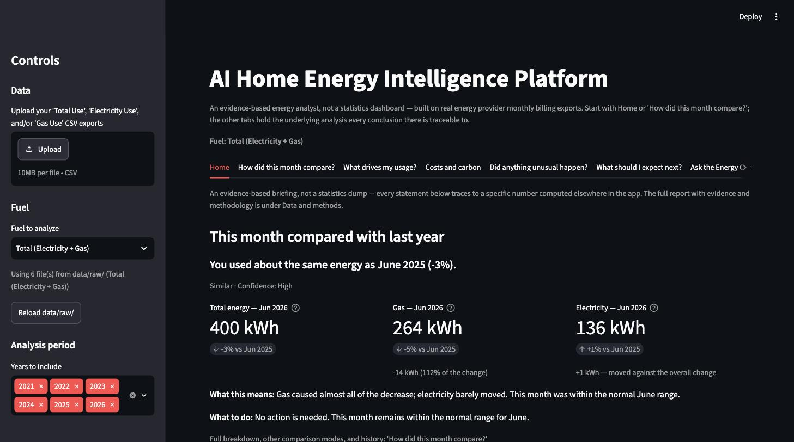
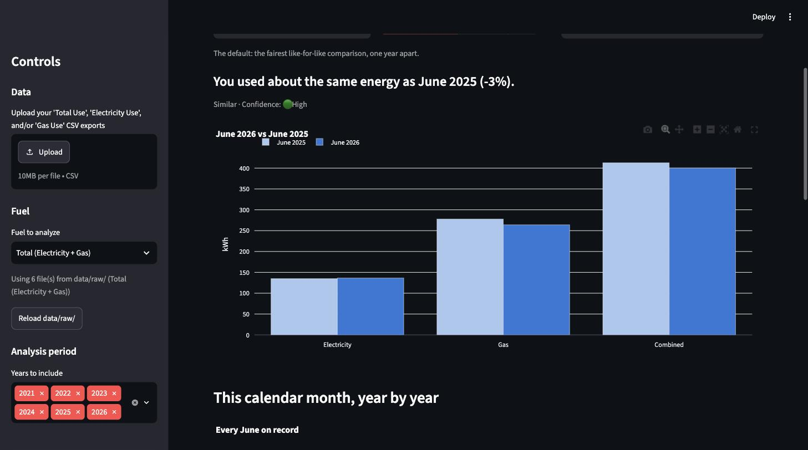
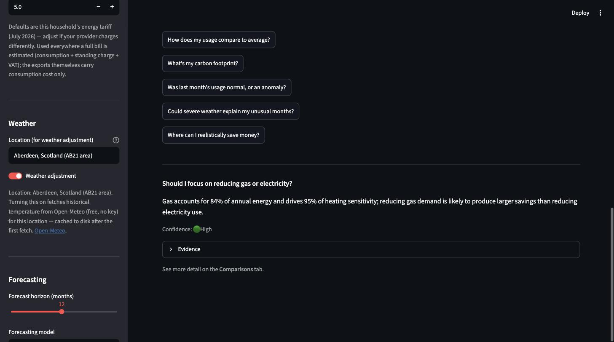
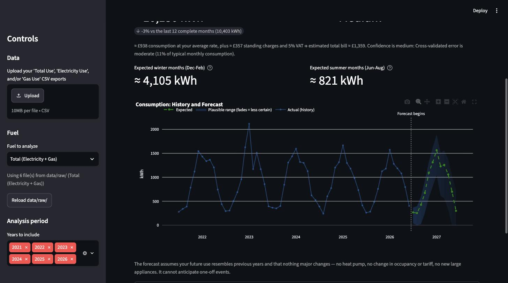

# AI Home Energy Intelligence Platform

[](https://github.com/djimrastephane/energy_ai/actions/workflows/tests.yml)


An evidence-based energy analyst for your home -- not a statistics
dashboard. Runs entirely on your machine from your energy provider's
monthly billing CSV exports: no cloud, no LLM, no API keys. Every conclusion is
deterministic and traceable to a specific computed number, carries a
confidence rating with its reason, and says "not enough evidence" instead
of guessing.



> The screenshots and example answers in this README come from the
> bundled synthetic demo dataset (`data/synthetic/`, [generated by a
> documented script](scripts/generate_synthetic_dataset.py) from real
> Aberdeen weather + a household energy model) -- never a real person's
> data. Every number you see is a genuine output of the app running on
> that dataset, just not anyone's actual bill.

**Contents:** [What it can tell you](#what-it-can-tell-you) ·
[Features](#features) · [Screenshots](#screenshots) ·
[Quick start](#quick-start) · [Your data](#your-data) ·
[Design principles](#design-principles) ·
[Project layout](#project-layout) ·
[More documentation](#more-documentation)

## What it can tell you

Real answers, computed by the app from the synthetic demo dataset:

| You ask | It answers |
|---|---|
| How did this month compare with last year? | *"You used about the same energy as June 2025 (-3%). This month was within the normal June range. No action is needed."* |
| Should I focus on reducing gas or electricity? | *"Gas accounts for 84% of annual energy and drives 95% of heating sensitivity; reducing gas demand is likely to produce larger savings than reducing electricity use."* |
| Was the difference caused by weather? | *"Mostly yes -- the weather accounts for the larger share of the change. Of the -12 kWh change, -12 kWh matches what the temperature model expected and -1 kWh does not."* |
| How does my usage compare to average? | *"Electricity usage is below average for a UK household (1,733 kWh/year vs a 2,500 kWh/year reference). Gas usage is average for a UK household (9,258 kWh/year vs a 9,500 kWh/year reference)."* |

## Features

- **Month-first journey** -- the default view compares the latest
  *complete* month with the same calendar month last year (never January
  vs December: that mostly measures the seasons, and never a partial
  month presented as complete). Alternative modes: previous month,
  typical/best/worst same-calendar month, long-term trend. Changes are
  split into weather-explained and unexplained parts, attributed to gas
  vs electricity, and judged in words ("Higher but weather-explained"),
  with documented practical thresholds -- see
  [docs/month_comparison.md](docs/month_comparison.md).
- **AI Consultant & AI Analyst** -- 17 canonical questions with free-text
  routing (month-comparison questions answer for the currently selected
  month, fuel, and comparison mode -- never stale state), plus a full
  written report. Deterministic (no LLM): every answer cites its
  evidence, and unmatched questions get the question list back, never a
  guess.
- **Weather-adjusted analysis** -- the standard degree-day "energy
  signature" regression (Open-Meteo, free, cached to disk for offline use)
  separates weather from behaviour; snow/wind/severe-weather context
  explains unusual months without ever claiming causation
  ([docs/weather_context.md](docs/weather_context.md)). Cooling terms stay
  in the model for reuse in warmer climates, but for a home without air
  conditioning -- like the Aberdeen climate used as this app's default
  location, where cooling degree days are zero across the entire history
  -- cooling is reported as undetectable and kept out of the main view,
  never fabricated. Your own location is searchable and confirmable from
  the sidebar.
- **Forecasting** -- 8 models (naive through SARIMA, Prophet, XGBoost,
  LightGBM) compared by walk-forward cross-validation, with P10/P50/P90
  bands. Whichever model wins is used -- if that's the simplest one, the
  app says so plainly rather than dressing up complexity that didn't help.
- **Unusual-month detection** -- three cross-referenced anomaly methods
  plus change-point detection, each flagged month getting a "possible
  causes" checklist that only ticks what the data actually supports.
- **Multi-fuel intelligence** -- a sidebar Fuel selector drives the whole
  app as Total, Electricity-only, or Gas-only; cross-fuel anomaly
  attribution, cost breakdowns, CO2e estimates (cited factors), and
  UK/Scotland benchmarking.
- **Household Energy Review** -- a downloadable, self-contained HTML report
  (interactive charts, print stylesheet for Save-as-PDF).

## Screenshots

**How did this month compare?** -- the primary journey: latest complete
month vs the same calendar month last year, with fuel and comparison-mode
controls and the two-period chart.



**Ask the Energy Consultant** -- pick a question or type your own; every
answer states its confidence and cites the evidence behind it, and
unmatched questions get the question list back rather than a guess.



**What should I expect next?** -- answer-first forecasting: expected use
and confidence lead; the model and the plausible range live in collapsed
detail sections, and the uncertainty band visibly fades with the horizon.



## Quick start

```bash
cd energy_ai
python3 -m venv .venv
./.venv/bin/pip install -r requirements.lock && ./.venv/bin/pip install -e . --no-deps
./.venv/bin/streamlit run app/streamlit_app.py
```

No data of your own yet? Upload the bundled demo CSVs from
`data/synthetic/` using the sidebar's uploader to explore every tab
immediately -- no need to touch `data/raw/`.

Tests and linting (the suite is network-free -- weather calls are mocked
or served from the disk cache):

```bash
./.venv/bin/pytest -v
./.venv/bin/ruff check src tests app config.py scripts
./.venv/bin/mypy
```

Dependencies are declared in `pyproject.toml` (floor versions); CI and the
quick start install from `requirements.lock`, the exact known-good set. To
upgrade: bump the floor in `pyproject.toml` if needed, then regenerate the
lock with `pip install -e ".[dev]" && pip freeze --exclude-editable > requirements.lock`.

## Your data

Works with any energy provider's monthly billing export -- not tied to one
company. These are *monthly* billing summaries, not smart-meter readings
-- every analysis here is scoped to what ~35 monthly observations
honestly support, rather than faking daily-data resolution.

Expected format (a real excerpt from the bundled demo dataset,
`data/synthetic/Total Use 2024.csv`):

```csv
Month,Cost (£),Consumption (kWh)
January 2024,141.65,1595.99
February 2024,117.46,1319.17
March 2024,116.85,1300.29
```

- **One file per year.** `Total Use <year>.csv` is all you need; separate
  `Electricity Use <year>.csv` / `Gas Use <year>.csv` files are optional
  and unlock fuel-level analysis (cross-checked against Total for
  consistency, so a mismatch gets flagged, not silently trusted).
- **The filename is how the app tells the files apart** -- it must
  contain "Total Use", "Electricity Use", or "Gas Use" somewhere in it.
  Rename the file if your provider's export is named differently.
- Drop your files into `data/raw/`, or upload them from the sidebar.
  Nothing assumes the input is clean: duplicates, conflicts, missing
  months, and implausible values are detected and reported on the Data
  Quality tab.

## Design principles

- **Never invent a number.** Standing charges and VAT aren't in the
  exports, so bill totals only appeared once the user supplied the actual
  tariff facts (standing charge rates in p/day, VAT %, 6th-to-5th billing
  cycle -- `config.BillingConfig`, editable in the sidebar); every bill
  figure is labelled as the estimate it is, component by component. No
  solar/EV/battery recommendation exists because no roof/vehicle/appliance
  data exists -- enforced by the absence of a code path, not a runtime
  check.
- **Evidence and confidence on everything.** Findings and recommendations
  carry their evidence lines, a High/Medium/Low rating, and the reason for
  that rating; builders return nothing rather than fabricate.
- **Hedged, not causal.** Monthly bills can't prove behaviour: wording is
  "may have contributed" / "cannot be confirmed from monthly data", tested
  to never assert home-working or occupancy as fact.
- **Prefer simple models**, and say so when they win.

## Project layout

```
energy_ai/
├── app/               # Streamlit UI: 9 question-oriented tabs, sidebar, charts, HTML report
├── src/               # all analysis logic -- no Streamlit imports, unit-testable directly
├── data/raw/          # your energy provider's CSV exports (data/processed/ holds the weather cache)
├── data/synthetic/    # non-personal demo dataset used for this README's screenshots and examples
├── scripts/           # generate_synthetic_dataset.py, pipeline profiling, month-comparison verification
├── docs/              # roadmap, month-comparison + weather data dictionaries, audit reports, screenshots
├── tests/             # pytest suite: unit + integration + UI (AppTest), network-free
└── config.py          # paths, thresholds, weather/benchmark/carbon constants -- all in one place
```

Navigation is organized around user questions -- Home, "How did this
month compare?", "What drives my usage?", "Costs and carbon", "Did
anything unusual happen?", "What should I expect next?", "Ask the Energy
Consultant" -- with whole-period views under **Long-term trends** and the
statistical machinery (full AI Analyst report, diagnostics, data
quality) under **Data and methods**: demoted, never deleted.

Each module carries a docstring explaining what it does and why -- the
layout above is deliberately shallow; start at `app/streamlit_app.py` or
`src/report.py` and follow the imports.

## More documentation

- [docs/roadmap.md](docs/roadmap.md) -- the full build history, phase by
  phase, including every real bug that manual verification against real
  data caught along the way.
- [docs/month_comparison.md](docs/month_comparison.md) -- why
  same-month-last-year is the default, how partial months are handled,
  the weather decomposition, change-category thresholds, judgement
  labels, and edge-case fallbacks.
- [docs/weather_context.md](docs/weather_context.md) -- weather data
  dictionary, severe-weather thresholds and sources, cache versioning,
  interpretation rules.
- [docs/audits/](docs/audits/) -- a full engineering/security/performance/
  UX audit with before/after measurements.